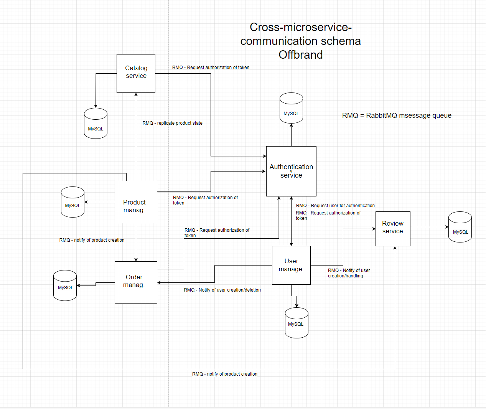

<p align="center">
  <a href="http://nestjs.com/" target="blank"></a>
</p>

[circleci-image]: https://img.shields.io/circleci/build/github/nestjs/nest/master?token=abc123def456
[circleci-url]: https://circleci.com/gh/nestjs/nest

  <p align="center">A progressive <a href="http://nodejs.org" target="_blank">Node.js</a> framework for building efficient and scalable server-side applications.</p>
    <p align="center">
<a href="https://www.npmjs.com/~nestjscore" target="_blank"></a>
<a href="https://www.npmjs.com/~nestjscore" target="_blank"></a>
<a href="https://www.npmjs.com/~nestjscore" target="_blank"></a>
<a href="https://circleci.com/gh/nestjs/nest" target="_blank"></a>
<a href="https://coveralls.io/github/nestjs/nest?branch=master" target="_blank"></a>
<a href="https://discord.gg/G7Qnnhy" target="_blank"></a>
<a href="https://opencollective.com/nest#backer" target="_blank"></a>
<a href="https://opencollective.com/nest#sponsor" target="_blank"></a>
  <a href="https://paypal.me/kamilmysliwiec" target="_blank"></a>
    <a href="https://opencollective.com/nest#sponsor"  target="_blank"></a>
  <a href="https://twitter.com/nestframework" target="_blank"></a>
</p>
  <!--[](https://opencollective.com/nest#backer)
  [](https://opencollective.com/nest#sponsor)-->

## Description

A comprehensive microservices project of a ecommerce site backend using [Nest](https://github.com/nestjs/nest), RabbitMQ, Prisma and docker.

### Implementation
The following picture shows a simple overview over how the different microservices talks to each other with the help
of RabbitMQ.



The system supports the following three roles:
 - **admin**
 - **worker**
 - **user**

Here is an small summarization of each microservice. 

 - **Product-management-service**: Handles everything related with product handling such as creating and handling  products, creating and handling inventories as well as creating and handling discounts and categories. Only an admin can utuilize these endpoints.   

 - **Autentication-service**: Handles the authentication and authorization of users. Any microservice that is utilizing authentication and authorization completes these checks by communicating with this service through RabbitMQ.     

  - **Catalog-service**: Replicates the state of the product-management and is used to retrive the availible products on the site. No authorization or authentication is needed to reach these endpoints.  

  - **Order-management-service**: Handles everything that is related to handling orders. The endpoint one can access is dependant on ones role. The order-management-service uses rabbitMQ when creating an order to see if there is enough products in stock to "make the purchase" i.e creating a valid order.    

  - **User-management-service**: Handles everything related to user management such as the creation and deletion of users. The endpoint one can access here is dependent on the role. Once a new user has been created it notifies the order-management-service and the review-service that a new user has been created.      

  - **Review-service**: Handles everything related to creating, retriving, updating and deleting reviews.    

## Prerequisites

- Docker installed on your local machine. You can follow Docker's tutorial for [macOS](https://docs.docker.com/desktop/install/mac-install/) or [Windows](https://docs.docker.com/desktop/install/windows-install/).
 - The Docker-Compose plugin installed on your machine. You can find download instructions [here](https://docs.docker.com/compose/install/).


## Running the app

```bash
cd script
./deploy.sh
```

## Test

As of now there is no extensive testing due to time constraints, but it is setup to implement. 

## License

Nest is [MIT licensed](LICENSE).
